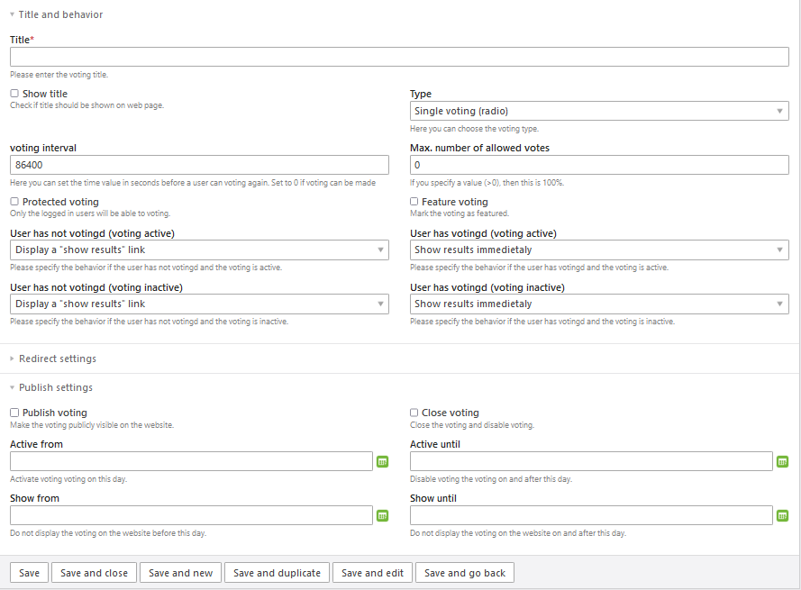

## Create polls and voting for Contao Open Source CMS ##

This bundle is based on [contao-polls](https://github.com/codefog/contao-polls). It is sligthly modified,
a couple on bug fixes were applied and the whole bundle is made compatible with the developer rules defined for
[Contao 5.3](https://contao.org/de/).

## Setup a voting request

To setup a new vote request go to the `Voting` (in `CONTENT` tab)

Then you can create a new record using the `New voting` button. The voting configuration form has many 
options, but they are prefilled with the ready-to-use values.

Next important thing is the behavior configuration. Here you have to set how the vooting behaves after user 
has or has not voted. The most optimal behavior has been set as the default, but you can adjust it to your needs anytime.

Once you are done with the voting configuration, you have to create the voting options. Each option has the 
percentage bar displaying the current amount of the voting, if you have not sepcified a `Max. number of votes`. 
You can also view and manage the voting using the `voting` button in every row.

## Publish on the website

When the voting is ready, you can put it on the website as content element. You can either choose the voting manually or let the script find the most current one (based on voting settings).

On your web sute it will look like

On the web site you (and in back end) you will see the results (the provided `bundles/voting/style/voting.css` is
base on the [ODD Theme](https://contao-themes.net/theme-detail/odd.html). If you want to customize your `CSS` setting please create a new file `_custom.ss` in same directory.

If you have specifies `Max. number of votes` then you will see a sligthly different screen.

## Reset the poll

After all tests you can easily reset all votings using the `Reset voting` button at the top of the page:

Please enjoy!

If you enjoy my software, I would be happy to receive a donation.

